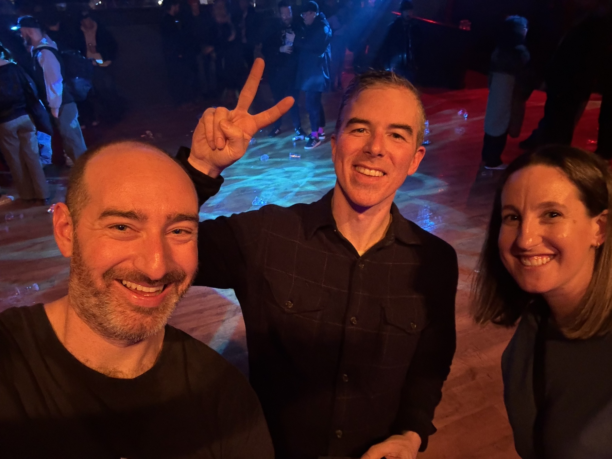

## Table of Contents

## Mount Kimbie - "Empty and Silent" (feat. King Krule)

This is probably my favorite song so far of Mount Kimbie's forthcoming album. None of their collaborations with King Krule have missed, but with the full-band sound and the way the song builds, this one is really great and has me pumped to see them at Webster Hall in May.

<iframe style="border-radius:12px" src="https://open.spotify.com/embed/track/1SFUxSbBQbJqjN9rFOmYGk?utm_source=generator" width="100%" height="152" frameBorder="0" allowfullscreen="" allow="autoplay; clipboard-write; encrypted-media; fullscreen; picture-in-picture" loading="lazy"></iframe>

---

## From Indian Lakes - "The Flow"

This is the first single from From Indian Lakes' upcoming album. The production is a bit stripped down from their more electronic/layered previous album, [Dimly Lit](https://open.spotify.com/album/0dtDGXpIVneAFdLKWLTLAh?si=TDmd5a8WQj6P5lyuY5UiHA), giving this song a bit more of a straightforward rock sound.

<iframe style="border-radius:12px" src="https://open.spotify.com/embed/track/4qKN1tcFLmAJP7ZURRTl5k?utm_source=generator" width="100%" height="152" frameBorder="0" allowfullscreen="" allow="autoplay; clipboard-write; encrypted-media; fullscreen; picture-in-picture" loading="lazy"></iframe>

---

## Night Verses - "Glitching Prisms" (feat. Brandon Boyd)

I've never heard of this band until I came across a post on Brandon Boyd's Instagram last week, but I'm really digging this song. It has a bit of an electonic/progrock/math-y sound, and Brandon Boyd's voice is a great fit for it.

<iframe style="border-radius:12px" src="https://open.spotify.com/embed/track/5Zj5MaYPSk2u7wJhKYTfZk?utm_source=generator" width="100%" height="152" frameBorder="0" allowfullscreen="" allow="autoplay; clipboard-write; encrypted-media; fullscreen; picture-in-picture" loading="lazy"></iframe>

---

## Have Heart - "Something More Than Ink"

Can you believe a guy this happy (see picture) sings a song that goes this hard?

_Hanging with Pat Flynn after Fiddlehead at the Garage. London, UK, February 2024_

<iframe style="border-radius:12px" src="https://open.spotify.com/embed/track/7grHiK0w8Ia3OC7PQtjIZ7?utm_source=generator" width="100%" height="152" frameBorder="0" allowfullscreen="" allow="autoplay; clipboard-write; encrypted-media; fullscreen; picture-in-picture" loading="lazy"></iframe>

---

## Craft Spells - "Breaking the Angle Against the Tide"

You can thank the Spotify Daylist morning edition for this one. All of the bands from the Captured Tracks label during this are perfect for getting your day started.

<iframe style="border-radius:12px" src="https://open.spotify.com/embed/track/2hzV9jRJRWzrWocUOxcZVs?utm_source=generator" width="100%" height="152" frameBorder="0" allowfullscreen="" allow="autoplay; clipboard-write; encrypted-media; fullscreen; picture-in-picture" loading="lazy"></iframe>
